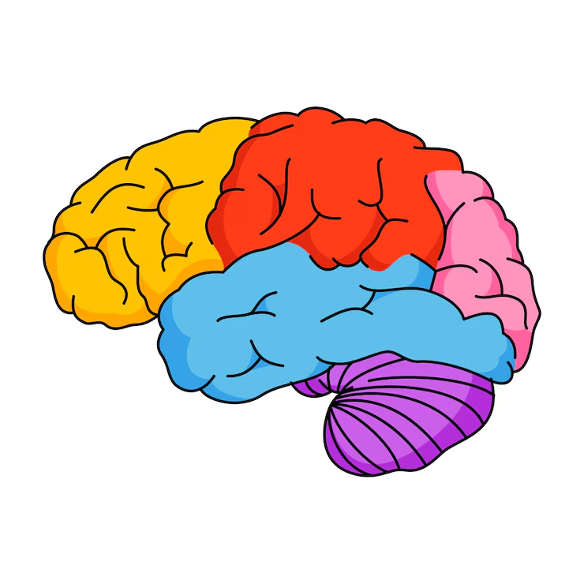

# 🧠 Brain MRI Tumor Detector (Shiny App)

This is an interactive R Shiny application that allows users to upload Brain MRI images and classify them as **tumor** or **non-tumor** using trained machine learning models.



---

## 🚀 Features

- Upload Brain MRI images (`.jpg`, `.png`)
- Extract pixel-based features (mean, SD, min, max)
- Choose from 3 classifiers:
  - ✅ Decision Tree (Pruned)
  - ✅ Naive Bayes
  - ✅ Random Forest
- View predictions instantly
- Visualize Random Forest feature importance
- Clean UI with `shinythemes::flatly`

---

## 🛠 Requirements

- R (≥ 4.0)
- R packages:
  ```r
  install.packages(c("shiny", "shinythemes", "imager", "ggplot2", "rpart", "e1071", "caret", "klaR", "randomForest"))
